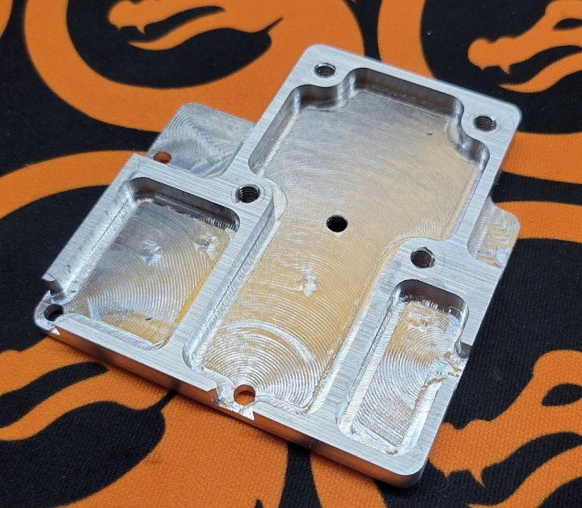
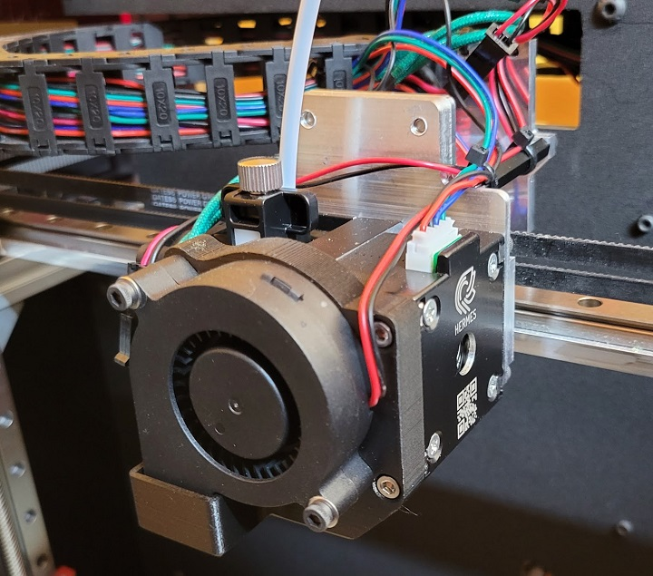

# Daedalus Hemera Adapter Plate

This is a design for an aluminum adapter plate to mount an E3D Hemera onto the [Project R3D Daedalus](https://www.projectr3d.com/shop/p/daedalus) without any physical modifications to the printer itself.

It bolts directly to the extruder carriage intended for a Bondtech BMG and, when using an E3D V6, will place the nozzle tip at the same Z offset. You will only need to change a few lines in the printer's `config.g` file.

The only real downsides are:

- Because the hemera is wider, you will lose about 10mm on the X axis, bringing the XY dimensions to 300x300mm. 
- The X position of the nozzle is shifted left compared to the stock extruder so items placed center bed in the slicer will actually be shifted left a bit when printed. This is fine since the bed itself is larger than 300x300mm - most print surfaces for the bed are 340x340. It simply means that things are shifted left of dead center on the bed, but still well within the usable area.
- When using the provided part cooling fan shround (which prevents any further X dimension loss), fan assembly can actually stick out the front of the machine a bit when at Y=0. Preventing the use of an enclosure that is flush with the front.
- This was designed for use with the standard V6 hotend. It is technically possible to use a volcano or other Hemera compatible hotend but you will need to find a solution to mount the Z probe lower.

## Required Components

You will need:

- The adapter plate itself. Note: this is **not** a printable item. It was designed to be milled from 1/4 inch or 6mm aluminum plate.
- 4x M4x8mm bolts, for mounting the adapter plate to the extruder carriage. 
- 4x M3x6mm bolts, for mounting the hemera to the adapter plate. Note, **do not** use anything longer than 6mm as it will break the Hemera!
- 4x M3x10mm bolts for mounting the part cooling duct to the hemera
- 2x M3x25mm bolts
- 2x M3 nuts
- 5015 radial blower fan rated for 24V
- 4-pin [Molex SL female](https://www.digikey.com/en/products/detail/molex/0050579404/115057) connector with appropriate crim connectors. See more below.
- E3D Hemera extruder and V6 hotend.

## Installation

As long as you replace the 5015 part cooling fan connector with the 4-pin Molex connector noted above, not modifications need to be made to the Daedalus itself other than pulling some of the cables through the chain a little more to provide some extra slack. 

First, print the provided [5015 fan mount](5015FanMount.stl) in a heat resistant material. PETG or ABS at a minimum but nylon or PC won't hurt.

Take the assembled Hemera and mount it to the adapter plate using the M3x6mm bolts with the completely flat side of the adapter facing the Hemera. Make sure the heater cartridge and thermister are mounted in the block so the wires are coming out the same side as the Hemera heatsink and fan.

Now mount the adapter plate to the Daedalus using the M4x8 bolts. Make sure they are good and tight.

You will need to replace the connector on the 5015 part cooling fan with the Molex SL connector. The stock Daedalus uses 2 part cooling fans, which is why it has 4 pins. Just make sure you match black and red between the connectors. It doesn't matter which you connect to.

Take the two M3 nuts and insert them into the hexagonal spots on the back of the part cooling duct. Use a couple small dabs of super glue on each to ensure they remain in place and give them a few minutes to dry.

Now attach the duct to the front of the hemera with the M3x10mm bolts.

Finally, use the M3x25mm bolts to attach the fan to the duct.

For wiring, follow the paths shown below.

There should be enough wire to reach everything but you may need to remove the back of the Daedalus and feed some extra wiring (especially for the extruder motor) through the cable chain. The connector from the Bondtech motor should plug right into the Hemera with no issues.

Provide some strain relief with some zip ties as show and you are done! Now on to the config...

## Configuration Updates.

This part is easy, just a few things to tweak. Load Duet Web Control for your Daedalus and open up `config.g`. Note, just worry about the values called out here. Leave any other non-extruder related values in the lines mentioned the same!

First, look for the motor currents line and change the extruder value to between 800 and 1200mA. I used 1100mA:

`M906 X1600 Y1600 Z1200 E1100 I60`

Change your axis max distance for X to 300mm:

`M208 X300 Y300 Z345`

Now update your steps/mm for the extruder to me 409:

`M92 X200 Y200 Z800 E409`

Next, you need to change your Z probe offset to `X8.75 Y62.45` to reflect the different position of the nozzle to the Z probe, for mesh leveling. You will want to come back to this line later when you calibrate your Z probe height offset. It will likely be close to what you had before, but best to get it right!

`G31 X8.75 Y62.45 Z2.6 P25`

That's it! Save the config and let the printer restart.
Once it's back online, I highly recommend running a PID autotune since it's a different hotend. Just in case.

